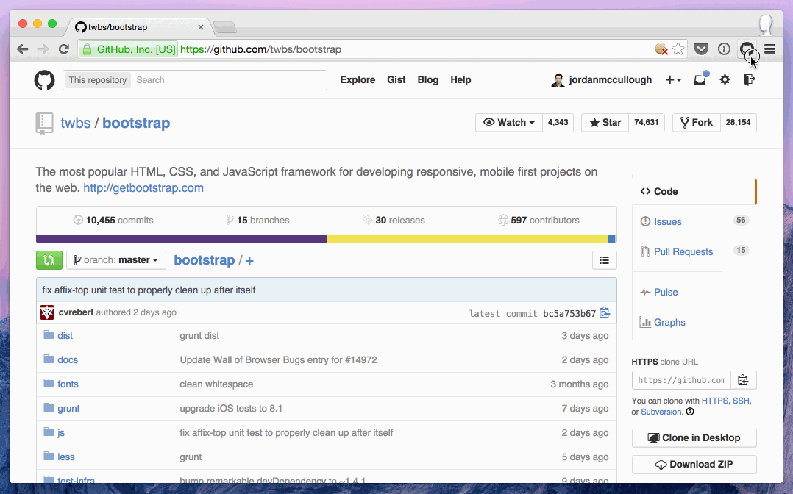

# Google Chrome Help.GitHub.com extension

## Installation

1. Launch Google Chrome
2. Browse to chrome://extensions
3. Enable Developer mode
4. Drag repo folder into Extensions page
5. Start using it

## Preview

